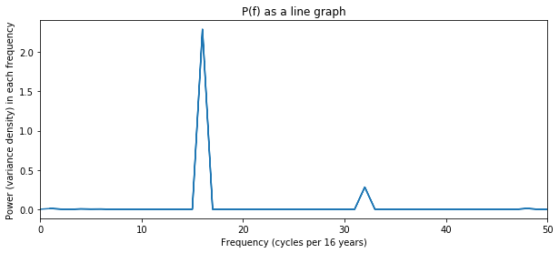
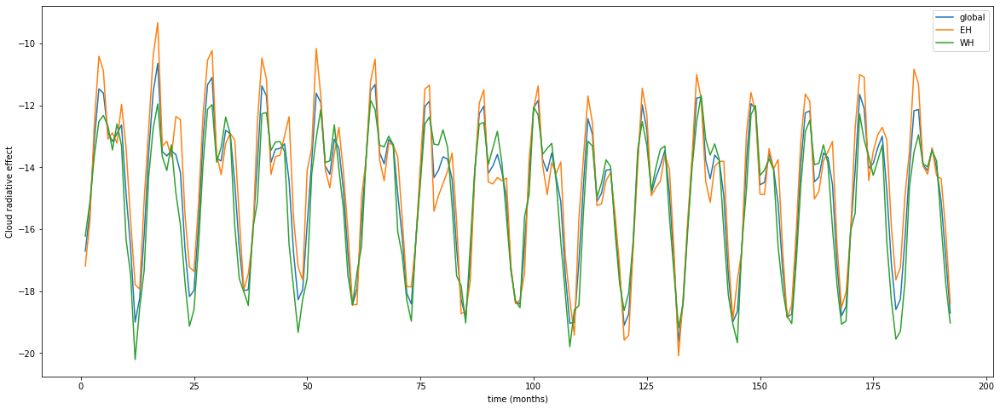

<a name="top"></a>
<div style="width:1000 px">

<div style="float:right; width:98 px; height:98px;">

</div>

<h1>Applied Data Analysis </h1>
    <h1>Sisam Shresta</h1>
<h1>ATM/MPO 624, spring 2020</h1>
<h2>Modeling the meaning of our data</h2>
<hr style="height:2px;">


# CERES data #
## Time period: 16 years ##
## Surface and TOA data ##


```python
import numpy as np
import xarray as xr
import matplotlib.pyplot as plt
plt.style.use('seaborn-whitegrid')
from datetime import datetime
```


```python
pip install dill
```

    Requirement already satisfied: dill in /home/sshrestha/anaconda3/envs/unidata/lib/python3.7/site-packages (0.3.1.1)
    Note: you may need to restart the kernel to use updated packages.


```python
import dill
dill.load_session('notebook_env.db')

```


```python
#import data for SFC fluxes
dataset = xr.open_dataset('/bsoden/CERES/CERES_SFC_CMIP.nc')

#import data for TOA fluxes (this has 1 year extra:2017)
dataset2 = xr.open_dataset('/bsoden/CERES/CERES_TOA_CMIP.nc')

#data = dataset.sel (lat=0, method ='nearest')

#slice the dataset to remove the awkward starting in 2006
dataset=dataset.sel(time=slice(datetime(2001,1,16),datetime(2017,12,16)))
dataset2=dataset2.sel(time=slice(datetime(2001,1,16),datetime(2017,1,1)))

lat = dataset2['lat'].values
NH = lat[lat>0]
SH = lat[lat<0]

lon = dataset2['lon'].values
EH = lon[lon<180.5]
WH = lon[lon>180]

```

# Cloud Radiative Effect at TOA #

$C = SW_{UP,clear} - SW_{UP,total} + LW_{UP,clear} - LW_{UP,total}$


```python
#calculate SW CRE at TOA
sutc = dataset2.rsutcs -dataset2.rsut


#claculate LW CRE at TOA
lutc = dataset2.rlutcs - dataset2.rlut


```


```python
#calculte TOA Cloud Radiative Effect

c = sutc + lutc
cNH = c.sel(lat=slice(0,90))        #Northern hemisphere
cSH = c.sel(lat=slice(-90,0))       #Southern hemisphere
cEH = c.sel(lon=EH)                 #Eastern hemisphere
cWH = c.sel(lon=WH)                 #Western hemisphere


#I had to make new arrays for reshaping calculations later on
C = np.copy(c)
CNH =np.copy(cNH)
CSH = np.copy(cSH)
CEH = np.copy(cEH)
CWH = np.copy(cWH)

```


```python
#weights for longitiude/latitude averaging
weight = np.cos(lat*np.pi/180.0)        #global
weightN = np.cos(NH*np.pi/180.0)        #NH
weightS = np.cos(SH*np.pi/180.0)        #SH

#plot cosine weighting
plt.plot(lat, weight)
plt.ylabel('Cosine weight')
plt.xlabel('latitude')
plt.title('Cosine weights of latitude')
```


    Text(0.5, 1.0, 'Cosine weights of latitude')


```python
#global mean cloud radiative effect at TOA
C_glbmean = np.mean(np.mean(C,axis=2)*weight,axis=1)


fig, ax = plt.subplots(figsize=(20,8))
ax.plot(C_glbmean, label ='global')
ax.set(xlabel='time (months)', ylabel='Cloud radiative effect', title ='Net TOA CRE')
ax.legend()
```


    <matplotlib.legend.Legend at 0x7f5a48dcc350>


## We can clearly see annual cycles for the 16 years. However, there seems to be a presence of a slight interannual cycle ##


```python
#power specturm attempt 

T = C_glbmean; NT = len(T)
Tp = T - T.mean()
Tspec = np.fft.fft( Tp )

fig,ax = plt.subplots(1,1,figsize=(10,4)); 
ax.plot(Tspec.real)
plt.title('real part: the mean, then a symmetric repeat of the spectrum')

```


    Text(0.5, 1.0, 'real part: the mean, then a symmetric repeat of the spectrum')


```python
#frequency 
freqs = np.array(range(NT))   # This gets the left end correct
reversed_freqs = freqs[::-1]  # Reverse the array 
reversed_freqs[0:int(NT/2)] = freqs[1:int(NT/2)+1] # Fix the low end of the reversed array
freqs = reversed_freqs[::-1]  # reverse it back

```


```python
Power = (Tspec.conjugate()*Tspec).real
Power = Power*(np.var(Tp) / Power.sum())       # Enforce Parseval's theorem for variance 
fig,ax = plt.subplots(1,1,figsize=(10,4)); 

ax.stem(freqs, Power)
ax.set_xlim([0,50])
ax.set_xlabel('Frequency (cycles per 16 years)')
ax.set_ylabel('Power (variance density) in each frequency')
plt.title('Discrete spectrum')

```

    /home/sshrestha/anaconda3/envs/unidata/lib/python3.7/site-packages/ipykernel_launcher.py:5: UserWarning: In Matplotlib 3.3 individual lines on a stem plot will be added as a LineCollection instead of individual lines. This significantly improves the performance of a stem plot. To remove this warning and switch to the new behaviour, set the "use_line_collection" keyword argument to True.
      """


    Text(0.5, 1.0, 'Discrete spectrum')


```python
fig,ax = plt.subplots(1,1,figsize=(10,4)); 

ax.plot(freqs, Power)
ax.set_xlim([0,50])
ax.set_xlabel('Frequency (cycles per 16 years)')
ax.set_ylabel('Power (variance density) in each frequency')
plt.title('P(f) as a line graph')

```


    Text(0.5, 1.0, 'P(f) as a line graph')





```python
#check hemisphere effect SH/NH

NH_mean = np.mean(np.mean(CNH,axis=2)*weightN,axis=1)
SH_mean = np.mean(np.mean(CSH,axis=2)*weightS,axis=1)

time = np.arange(1, C.shape[0]+1)

fig, ax = plt.subplots(figsize=(20,8))
ax.plot(time, C_glbmean, label ='global')
ax.plot(time,NH_mean, label='NH')
ax.plot(time,SH_mean, label='SH')
ax.legend()
ax.set(xlabel='time (months)', ylabel='Cloud radiative effect')
plt.title('TOA CRE')
```


    Text(0.5, 1.0, 'TOA CRE')


```python
#check lw vs short wave CRE
LW_gmean = np.mean(np.mean(lutc,axis=2)*weight,axis=1)
SW_gmean = np.mean(np.mean(sutc,axis=2)*weight,axis=1)

time = np.arange(1, C.shape[0]+1)

fig, ax = plt.subplots(figsize=(20,8))
ax.plot(time, C_glbmean, label ='global')
ax.plot(time,LW_gmean, label='LW')
ax.plot(time,SW_gmean, label='SW')
ax.legend()
ax.set(xlabel='time (months)', ylabel='Cloud radiative effect')
plt.title('TOA CRE')
```


    Text(0.5, 1.0, 'TOA CRE')


```python
#check if it's the SH/NH SW CRE
SW_SH = sutc.sel(lat=slice(-90,0))
SW_NH = sutc.sel(lat=slice(0,90))


SW_SHm = np.mean(np.mean(SW_SH,axis=2)*weightS,axis=1)
SW_NHm = np.mean(np.mean(SW_NH,axis=2)*weightN,axis=1)


time = np.arange(1, C.shape[0]+1)

fig, ax = plt.subplots(figsize=(20,8))
ax.plot(time, C_glbmean, label ='global')
ax.plot(time,SW_SHm, label='S_SH')
ax.plot(time,SW_NHm, label ='S_NH')
ax.legend()
ax.set(xlabel='time (months)', ylabel='Cloud radiative effect')
plt.title('TOA CRE')
```


    Text(0.5, 1.0, 'TOA CRE')


```python
#check eastern/western hemisphere
EH_mean = np.mean(np.mean(CEH,axis=2)*weight,axis=1)
WH_mean = np.mean(np.mean(CWH,axis=2)*weight,axis=1)

time = np.arange(1, C.shape[0]+1)

fig, ax = plt.subplots(figsize=(20,8))
ax.plot(time, C_glbmean, label ='global')
ax.plot(time,EH_mean, label='EH')
ax.plot(time,WH_mean, label='WH')
ax.legend()
ax.set(xlabel='time (months)', ylabel='Cloud radiative effect')
plt.title('TOA CRE')
```


    Text(0.5, 1.0, 'TOA CRE')


```python
#reshaped the TOA CRE to get 16 years/12 months
C_rshp = C.reshape(16,12,180,360)
C_acycle = np.mean(np.mean(np.mean(C_rshp,axis=3)*weight,axis=2),axis=0)

#reshaping for NH
CNH_rshp = CNH.reshape(16,12,90,360)
CNH_acycle = np.mean(np.mean(np.mean(CNH_rshp,axis=3)*weightN,axis=2),axis=0)

#reshaping for NH
CSH_rshp = CSH.reshape(16,12,90,360)
CSH_acycle = np.mean(np.mean(np.mean(CSH_rshp,axis=3)*weightS,axis=2),axis=0)

time = np.arange(1, len(C_acycle)+1)


fig, ax = plt.subplots(3, 1, sharex=True, sharey=True, figsize=(10,20))
ax[0].plot(time,C_acycle, label ='TOA annual cycle')
ax[1].plot(time,CNH_acycle, label ='TOA annual cycle')
ax[2].plot(time,CSH_acycle, label ='TOA annual cycle')

ax[0].title.set_text('Global TOA annual')
ax[1].title.set_text('NH TOA annual')
ax[2].title.set_text('SH TOA annual')


plt.xlabel('Months')
plt.ylabel('CRE')
plt.show()

```


```python
#sine of latitude
slat = np.sin(np.deg2rad(lat))

#zonally averaged CRE. Here, C is the net TOA CRE (time,lat,lon) that I've already calculated. I have 16 years of monthly data
z_CRE = np.mean(C,axis=2)

#flip axes to plot against time
a=z_CRE.transpose()

a.shape
```


    (180, 192)


```python
#plot the TOA CRE contour
fig=plt.figure(figsize=[15,10])
ax=fig.add_subplot(111)
cs = ax.contourf(dataset.time,slat,a,40,cmap='bwr',extend='both')
cb = plt.colorbar(cs,ticks=np.arange(-150,150,50))
cb.set_label('CRE',fontsize=16)
ax.set_title('Zonally averaged CRE as function of latitude',fontsize=20)
ax.set_ylabel('sin(lat)',fontsize=18)
ax.set_xlabel('time',fontsize=18)
plt.show()
```


<hr style="height:2px;">


# Cloud Radiative Effect at the Surface #

$C = SW_{DOWN,total} - SW_{DOWN,clear} + SW_{UP,clear} - SW_{UP,total} + LW_{DOWN,total} - LW_{DOWN,clear}$


```python
#calculate SW CRE at surface

ss = dataset.rsds - dataset.rsdscs + dataset.rsuscs - dataset.rsus

#calculate LW CRE at surface
ls = dataset.rlds - dataset.rldscs

#caculate CRE at surface
CS = ss + ls
CSNH = CS.sel(lat=slice(0,90))        #Northern hemisphere
CSSH = CS.sel(lat=slice(-90,0))       #Southern hemisphere
CSEH = CS.sel(lon=EH)                 #Eastern hemisphere
CSWH = CS.sel(lon=WH)                 #Western hemisphere

cS = np.copy(CS)
cSNH = np.copy(CSNH)
cSSH = np.copy(CSSH)
```


```python
#calculate and plot global mean surface CRE as a function of time
CS_glbmean = np.nanmean(np.nanmean(CS,axis=2)*weight,axis=1)
time = np.arange(1, CS.shape[0]+1)

fig, ax = plt.subplots(figsize=(20,8))
ax.plot(time, CS_glbmean, label ='global')
ax.legend()

ax.set(xlabel='time (months)', ylabel='Cloud radiative effect')

plt.title('Surface CRE')
```


    Text(0.5, 1.0, 'Surface CRE')


```python
#power pecturm attempt 

S = CS_glbmean
NS = len(S)
Sp = S - S.mean()
Sspec = np.fft.fft( Sp )

fig,ax = plt.subplots(1,1,figsize=(10,4)); 
ax.plot(Sspec.real)
plt.title('real part: the mean, then a symmetric repeat of the spectrum')


```


    Text(0.5, 1.0, 'real part: the mean, then a symmetric repeat of the spectrum')


```python
# Define the frequencies "freqs"

freqsS = np.array(range(NS))   # This gets the left end correct
reversed_freqsS = freqsS[::-1]  # Reverse the array 
reversed_freqsS[0:int(NS/2)] = freqsS[1:int(NS/2)+1] # Fix the low end of the reversed array
freqsS = reversed_freqsS[::-1]  # reverse it back
```


```python
PowerS = (Sspec.conjugate()*Sspec).real
PowerS *= np.var(Sp) / PowerS.sum()       # Enforce Parseval's theorem for variance 
fig,ax = plt.subplots(1,1,figsize=(10,4)); 

ax.stem(freqsS, PowerS)
ax.set_xlim([0,50])
ax.set_xlabel('Frequency (cycles per 16 years)')
ax.set_ylabel('Power (variance density) in each frequency')
plt.title('Discrete spectrum')

#print('V0ariance is', Vp.var(), '(m/s)^2: matches', sum(Power))

```

    /home/sshrestha/anaconda3/envs/unidata/lib/python3.7/site-packages/ipykernel_launcher.py:5: UserWarning: In Matplotlib 3.3 individual lines on a stem plot will be added as a LineCollection instead of individual lines. This significantly improves the performance of a stem plot. To remove this warning and switch to the new behaviour, set the "use_line_collection" keyword argument to True.
      """


    Text(0.5, 1.0, 'Discrete spectrum')


```python
fig,ax = plt.subplots(1,1,figsize=(10,4)); 

ax.plot(freqsS, PowerS)
ax.set_xlim([0,50])
ax.set_xlabel('Frequency (cycles per 16 years)')
ax.set_ylabel('Power (variance density) in each frequency')
plt.title('P(f) as a line graph')

```


    Text(0.5, 1.0, 'P(f) as a line graph')


```python
#check the hemispheric effect for SH/NH
CSNH_mean = np.mean(np.mean(CSNH,axis=2)*weightN,axis=1)
CSSH_mean = np.mean(np.mean(CSSH,axis=2)*weightS,axis=1)


time = np.arange(1, CS.shape[0]+1)

fig, ax = plt.subplots(figsize=(20,8))
ax.plot(time, CS_glbmean, label ='global')
ax.plot(time,CSNH_mean, label='NH')
ax.plot(time,CSSH_mean, label='SH')
ax.legend()

ax.set(xlabel='time (months)', ylabel='Cloud radiative effect')
plt.title('Surface CRE')
```


    Text(0.5, 1.0, 'Surface CRE')


```python
#check SW vs LW effect
LW_s = np.mean(np.mean(ls,axis=2)*weight,axis=1)
SW_s = np.mean(np.mean(ss,axis=2)*weight,axis=1)

time = np.arange(1, CS.shape[0]+1)

fig, ax = plt.subplots(figsize=(20,8))
ax.plot(time, CS_glbmean, label ='global')
ax.plot(time,LW_s, label='LW')
ax.plot(time,SW_s, label='SW')
ax.legend()
ax.set(xlabel='time (months)', ylabel='Cloud radiative effect')
plt.title('Surface CRE')
```


    Text(0.5, 1.0, 'Surface CRE')


```python
#SW of SH/NH
SW_SHs = ss.sel(lat=slice(-90,0))
SW_NHs = ss.sel(lat=slice(0,90))

SW_SHsm = np.mean(np.mean(SW_SHs,axis=2)*weightS,axis=1)
SW_NHsm = np.mean(np.mean(SW_NHs,axis=2)*weightN,axis=1)

time = np.arange(1, CS.shape[0]+1)

fig, ax = plt.subplots(figsize=(20,8))
ax.plot(time, CS_glbmean, label ='global')
ax.plot(time,SW_SHsm, label='SH')
ax.plot(time,SW_NHsm, label='NH')
ax.legend()
ax.set(xlabel='time (months)', ylabel='Cloud radiative effect')
plt.title('Surface CRE')
```


    Text(0.5, 1.0, 'Surface CRE')


```python
#check eastern/western hemisphere
EHs_mean = np.mean(np.mean(CSEH,axis=2)*weight,axis=1)
WHs_mean = np.mean(np.mean(CSWH,axis=2)*weight,axis=1)

time = np.arange(1, C.shape[0]+1)

fig, ax = plt.subplots(figsize=(20,8))
ax.plot(time, CS_glbmean, label ='global')
ax.plot(time,EHs_mean, label='EH')
ax.plot(time,WHs_mean, label='WH')
ax.legend()
ax.set(xlabel='time (months)', ylabel='Cloud radiative effect')
```


    [Text(0, 0.5, 'Cloud radiative effect'), Text(0.5, 0, 'time (months)')]





```python
#reshape the surface CRE to get 16 years/12 months
CS_rshp = cS.reshape(16,12,180,360)
CS_acycle = np.mean(np.mean(np.mean(CS_rshp,axis=3)*weight,axis=2),axis=0)

#reshaping for NH
CSNH_rshp = cSNH.reshape(16,12,90,360)
CSNH_acycle = np.mean(np.mean(np.mean(CSNH_rshp,axis=3)*weightN,axis=2),axis=0)

#reshaping for NH
CSSH_rshp = cSSH.reshape(16,12,90,360)
CSSH_acycle = np.mean(np.mean(np.mean(CSSH_rshp,axis=3)*weightS,axis=2),axis=0)

month = np.arange(1,13)

fig, ax = plt.subplots(3, 1, sharex=True, sharey=True, figsize=(10,20))
ax[0].plot(month,CS_acycle)
ax[1].plot(month,CSNH_acycle)
ax[2].plot(month,CSSH_acycle)

ax[0].title.set_text('Global surface annual')
ax[1].title.set_text('NH surface annual')
ax[2].title.set_text('SH surface annual')


plt.xlabel('Months')
plt.ylabel('CRE')
plt.show()
```


```python
#zonally averaged CRE. 
s_CRE = np.mean(CS,axis=2)

#flip axes to plot against time
b = s_CRE.transpose()

```


```python
#plot the surface CRE contour
fig=plt.figure(figsize=[15,10])
ax=fig.add_subplot(111)
cs = ax.contourf(dataset.time,slat,b,40,cmap='bwr',extend='both')
cb = plt.colorbar(cs,ticks=np.arange(-120,100,10))
cb.set_label('CRE',fontsize=16)
ax.set_title('Zonally averaged CRE as function of latitude',fontsize=20)
ax.set_ylabel('sin(lat)',fontsize=18)
ax.set_xlabel('time',fontsize=18)
plt.show()
```


```python
#Surface CRE for equator

eq_s=CS.sel(lat=0.5)
eq_s=np.copy(eq_s)
eq_s_reshaped = eq_s.reshape(16,12,360)
eq_s_annual = np.mean(np.mean(eq_s_reshaped, axis=2),0)
month=np.arange(1, 13)
plt.plot(month,eq_s_annual)
plt.title('Equatorial surface CRE')
plt.xlabel('months')
plt.ylabel('CRE')
plt.show()
```


## Surface temperature ##


```python
#calculate temperature at SFC
temp = (dataset.rlus/(0.98*5.67e-8))**(1/4)
temp.shape

```


    (192, 180, 360)


```python
#temperature for a point in the southeast Pacific
temp_eq = temp.sel(lat=0.5, lon =270.5)

temp_eq =np.copy(temp_eq)
temp_eq_rshp = temp_eq.reshape(16,12)
temp_eq_annual=np.mean(temp_eq_rshp, axis = 1)    #interannual
temp_eq_szn = np.mean(temp_eq_rshp, axis = 0)     #seasonal
```


```python
#surface CRE at a point in the southeast pacific
CS_eq = CS.sel(lat=0.5, lon=270.5)
CS_eq = np.copy(CS_eq)
CS_eq_rshp = CS_eq.reshape(16,12)
CS_eq_annual = np.mean(CS_eq_rshp, axis = 1)     #interannaul
CS_eq_szn = np.mean(CS_eq_rshp, axis = 0)        #seasonal

```


```python
#plot CRE v/s Teperature for annual and seasonal cycles to compare their slopes
fig, axs = plt.subplots(1, 2)
axs[0].plot(CS_eq_annual,temp_eq_annual, 'o', color='black')
axs[0].set_title('Annual CRE vs T')
axs[1].plot(CS_eq_szn,temp_eq_szn, 'o', color='black')
axs[1].set_title('Seasonal CRE vs T')


for ax in axs.flat:
    ax.set(xlabel='CRE', ylabel='Temperature')

# Hide x labels and tick labels for top plots and y ticks for right plots.
for ax in axs.flat:
    ax.label_outer()
```


```python
#plot a timeseries of equatorial SST as a function of longitude
fig = plt.figure(figsize=[15,10])
ax = fig.add_subplot(111)
cs = ax.contourf(datas.lon,datas.time,tempe,cmap='RdYlBu_r',extend='both')
cb = plt.colorbar(cs, ticks=np.arange(280,315+10,2))
cb.set_label('SST',fontsize=16)
ax.set_title('Equatorial SST as a function of longitude',fontsize=20)
ax.set_xlabel('Longitude',fontsize=16)
ax.set_ylabel('Year',fontsize=16)
plt.show()
```


<a href="#top">Back to top </a>
